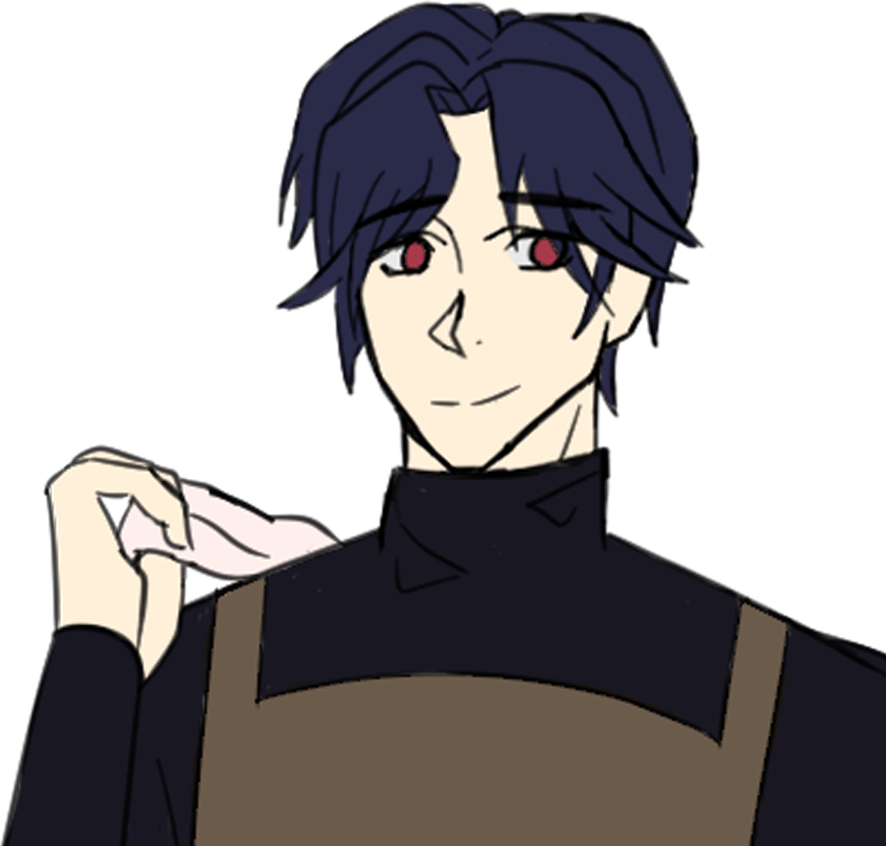
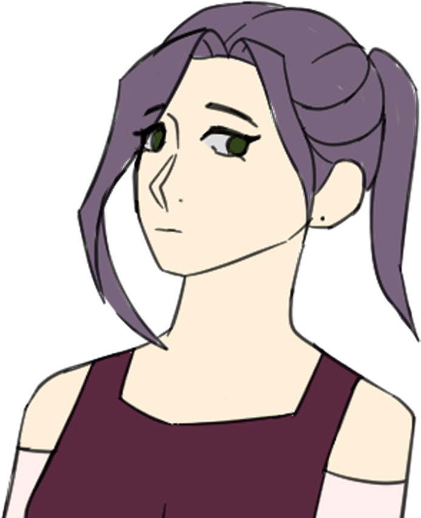
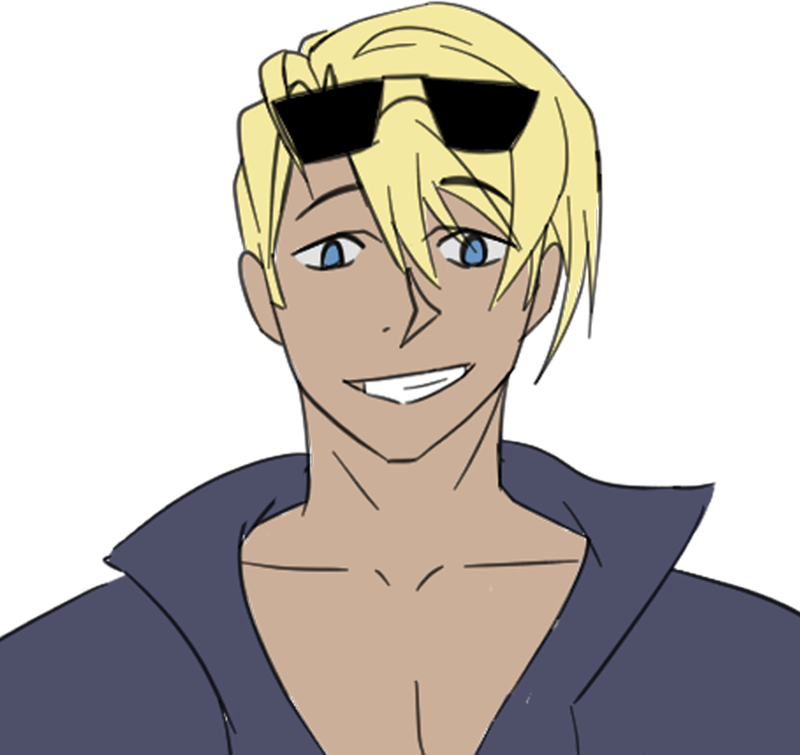
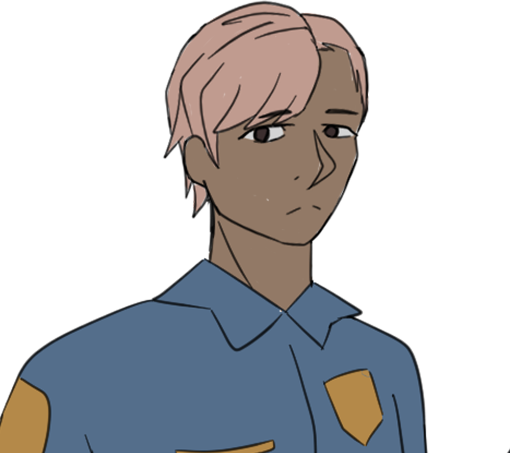

# Pouring Secrets: Our Happy Hours
### Video Game Design Project

### Collaborators:
* Robin: robinbd@hawaii.edu
* Lauren: laurenjc@hawaii.edu
* Connor: cviela@hawaii.edu

####  Trello Developmental Board
[View our progress on Trello](https://trello.com/b/UNZm15lE/ics485-project-board)

### February 28th, 2024: Individual Brainstorming
Individual Ideas
* (Connor) Cocktail/Bartender puzzle game / Talk simulator. Serve a few customers during happy hour and talk with them. Each character is suspicious. At the end of your shift, the police interrogate you. Informing you served a drink to a wanted criminal. Remember the conversations you had with each customer in addition to what pieces of evidence the police can share with you and find the criminal.
E.g. Coffee Talk + mystery game

* (Lauren) A farming simulator game about creating a farm and selling items to fund your personal expenses and items you need to buy to support your farm. It is set in a rural area, and there are obstacles like pests and dangerous wildlife that you must protect your farm from. If obstacles destroy too much of your crops, you will not make enough profit and will be forced to shut down your farm.

* (Robin) Something along the lines of Lil Guardsman or Papers Please, in which the player would have to deal with situations relating to people they rarely met, but they need to decide on whether they help them out to the player's detriment, or if they stick to the rules and deny that person help. Something like VALL-HAll-A where the player must interact with these characters, maybe even growing attached to them, and then having to decide their fate.
* E.g Lil Guardsman, Papers Please, Coffee Talk

### March 6th, 2024: Group Concept Writing & Designing
**Hook:**  A mystery game about a bartender serving customers, the goal is to solve the mystery of which of the customers you served that night is a wanted criminal

**World:** A small hole-in-the-wall bar
**Emotion/Mood/Tone:** Suspense of who the criminal might be, relaxing tasks of creating drinks and talking to customers, muted warm tones to convey a mellow, intimate, and relaxing theme
**Goals:** Create drinks, talk to customers, find the killer 
**Suspense in achieving goals:** Plot twist at the end where you realize you have to find the criminal, the goal is to pay attention to the customer dialogue or character description to find the criminal. Use the police’s clues.

**Obstacles:** creating the wrong drinks, not paying attention to clues 
**Interaction:** Customers and police officers
**Rules:** Follow the drink recipe, give the police the correct information, we engage with customers to gain clues
**Rewards:** Tips or clues that might offer more information, unlock new recipes

What happens in the next level: more customers, complex patterns and dialogue, more complex recipes. 

Story:
Serve a few customers during happy hour and talk with them. Each character is suspicious. At the end of your shift, the police interrogate you. Informing you served a drink to a wanted criminal. Remember the conversations you had with each customer in addition to what pieces of evidence the police can share with you and find the criminal.

### April 3rd, 2024: Prototype 1
(Connor) Created visual assets for the first set of characters. The main protagonist who is the bartender and owner of the mixology lounge named Dominic. The first customer is Tiara, who suffered a recent breakup. The second customer is Quinn, and currently in the works of developing assets for the UI and the background of the game.

(Robin) Formulated and started on the script writing and dialogue of the game. Fine tuned dialogue to make conversation feel more realistic, adding in subtle details and imagery descriptions. Worked to create the initial opening scene of the game, and the opening dialogue.

(Lauren) Crafted and put together the current assets into a UI menu, implemented the dialogue to scroll through on click in the Unity screen, screen recorded the demo of the prototype 1.

#### Preview of Prototype:

##### Script:
Another late night at the small bar. Dominic is reading a newspaper about recent events that have been happening, news of a sudden crime occured earlier in the week, just in the nearby neighorhoods. Disgruntled, he continues his startup at the Mixology Lounge, an area of little room, but lots of attention for the finer things. 

Bell rings
My first customer of the night.

Dominic: Welcome, come on in. Have a seat, anywhere on the bar is fine.

Tiara: Good evening.
She bobbed her head as she entered the room. As the door thudded behind her, she jumped slightly at the sound.

As she stammered across the room, her eyes darted around the decor, gazing at the portraits and artistry tapered across the walls. 

Dominic: You look like a new face, what can I get for you tonight? 

Her eyes met the look of the Black Dahlia hung atop the sidewall, enticed by the actresses' complexion. That same longing in both of their gazes.
She dragged the stool from underneath the bar counter and took a seat.

Tiara: …Do you have a menu..?

Dominic: Actually this is a mixology lounge. Better than your typical 5 bottle bar. Top shelf, bottom shelf, you name it, we probably got it. 
Be confident: Anything you ask for, I can make it easily.
Be considerate: If you want anything made to order, just ask.
Be cocky: Anything you can think of, I’ll make it taste better than anything you’ve tried before.

Tiara: A-Alright, then… how about a Manhattan? A little sweeter, if that’s okay.

Dominic: A Manhattan? Sounds good, leave it to me.

Makes a drink in the game, and can’t fail the tutorial level.

Dominic: And here you are miss, one Manhattan. With an extra cherry on top just for you.

### April 24th, 2024
(Robin) More script work and concept writing about the 4 characters were finished.

(Lauren) Creating the multiple choice options for dialoge was implemented.

(Connor) Touch ups on assets and dialog boxes were completed. 

#### Character Concept Writeup

**Client 1: Tiara** - A woman who had been struggling with a tough and toxic relationship where domestic abuse has become prevalent in her day to day life. Though, it did not start off that way, as they did have good moments, but once things began to get serious between the two of them, the boyfriend became quick tempered and angry, blaming his own incompetence and insecurities onto her. During one instance of domestic abuse, she retaliates, and in self-defense, stands her ground. *Should she be the killer in this runthrough, she would have felt a sort of freeing elation in fighting back, taking the kitchen knife and letting out all of her resentment on her boyfriend’s body.* After the instance, she took what she could, and ran out the door. She plans on leaving this part of the city, wanting to leave that part of her life behind, even if it means starting over. She is somewhat scared to call herself free, worried about her boyfriend. *If she is the killer, she is actually worried about being caught for her murder. She also would have been shaky if a knife was mentioned* To try to find a spot to calm down, she wanders into the bar.

**Client 2: Quinn** - An ex-mobster who used to move around the low ranking crime rings under a greater mafia group. Instead of extorting, shaking down debtors, he usually stacks the books, making sure that the blood money the mobster gets becomes clean money. He does so by buying and selling mattresses. During this time, he has been pocketing some of the money, and left a year ago. Recently one of the old mobsters, Tommy-Two Hands, tried to extort the money out of Quinn, and the two get into a kerfuffle. The altercation turns sour, but Quinn makes it out with the skin of his teeth. *If Quinn is the killer, then he kills Tommy Two-Hands during this altercation.* Quinn then hightails it out of there, trying to keep his composure, he heads downtown before trying to leave the city to escape the mob. In order to lay low for the moment, he decides to dip into the bar.

**Client 3: [Mail Person]** - They would spend their day to day working at the town’s only post office, acting as the mailer for the surrounding buildings. Efficiency and a good moral compass is their motto. They learned a lot of their ideals while training in karate. They could drone on and on about the morning route that they take, or even about saying hello to many of the neighbors. One day recently, while out on their normal routine of delivering mail, a thief tried to steal packages from them, and they managed to fend off of the robber. The robber had a knife, *If this person is the killer, then they turned the knife back onto the robber, causing one slice to their neck, becoming terrified of holding knives.* but instead the mailer disarmed them and the mailer gets away from the scene. Still shaken from the encounter, they take the ease off at the bar. They still will continue their job in the city as mailer, but they are shaken up by things for the moment.

**Client 4: [Lifeguard]** - This person works as an open water lifeguard at the nearby lake. Swimming has always been their passion, and they were very athletic at what they did. They took up lifeguard as an occupation in order to be closer with their passion as well as encourage others into swimming more as well. They ran a swimming program last summer, and are still proud of what they did. However, recently, there was a kid playing around with the others, and he would try to hold their breath underwater. What ended up happening was the kid got entangled in the water weeds before the surface of the water, and they did not come back up more than expected. The lifeguard noticed, as they noticed everything that happened at the lake, but did not act upon it. Finally, they acted, but too late. They removed the weeds from the kid’s feet and got them to land. They performed CPR, and the kid ended up surviving. If the Lifeguard is the killer, then unfortunate even with the resuscitation, the kid ends up passing away. The parents of the kid as well as the rest of the people there at the time all did not know what happened, but they know that the lifeguard “tried their best of their ability.” The lifeguard ends up taking the next few days off, and is thinking about quitting because of their incompetence, and is condemning their own slowness to react. *If the lifeguard is the killer, then the cop is looking for who was on duty during the kid’s death*. In order to cut the inner thoughts, they head over to the local bar.

The cop is at the bar, he opens up about the case, depending on if you can make him a good drink.  The bartender offers to help about the case since you've been given information, and if not, then will proceed to take you as well as some of the customers in for questioning.

### April 30th, 2024
**Due to time constraints as well as other life commitments, our game has been halved in size, and shall focus on the two initial customer characters, Tiara and Quinn as the premise of the story, with the player playing as the bartender Dominic.** 
Unfortunately, as much as we wished to work with a larger scale story with intertwining stories between the four customers, we must focus on the story of the first two. Tiara who fought back against her abusive boyfriend in self-defense, and Quinn, an ex-mobster who laundered money for the city's mafia syndicate. These changes will be reflected in our development notes.

(Robin) Shifted the narrative to focus on one story line, with split focus between Tiara and Quinn. 

**New Story Writeup:**

The player plays as Dominic, the mixologist of a small bar lounge. Through him, the player will meet and interact with Tiara, a woman who has been through countless amounts of verbal and physical harassment from her abusive boyfriend. However, at this point in time, Tiara fought back in order to survive against her partner, using a kitchen knife to end his life. She quickly ran from the scene and entered the mixology lounge to drink and forget. Throughout this time, by chatting and making good drinks, the player will learn more about her situation through small clues embedded in quipps and conversation. The better the atmosphere, the better the info. The second customer is Quinn. He has been running with the crime syndicates working as a frontman for a "mattress store," in which he cleans stolen money. He had enough being a grunt for the higher ups, so he pocketed some of the cash, and made a run for it. He plans on bouncing town and leaving, but the mob caught wind and are sure to look out for him. He enteres the mixology lounge in order to lay low, but not without a farewell situation. By chatting and offering good drinks with Quinn, he offers more info about his departure. The second second half of the game focuses on the problems of the two customers, as they find companionship with one another as well as with the player. Tiara opens up about her murder, but is scarred by the experience. Quinn hopes to bounce without any more people finding out, going as far as to bribe the player with some of the pocketed money. The finale of the game conducts with a detective entering the mixology lounge while Quinn is sitting off to the side with Tiara laying down on a couch, too inebriated to move. Detective Murphy then opens up about an ongoing investigation, and asks the player if they have any leads. The detective does not reveal any information about the case, so it is up to the player to mention either of Tiara's murder, or of Quinn's money laundering. Or the player may choose to stay quiet, which could jeopordize themselves if done incorrectly. Through a series of dialog choices and the potential opportunity to offer the Detective drinks, the player attempt to talk the detective out of following the cases by reasoning with the officer, get the customers arrested and taken in for custody, or the player themselves could land in jail for attempting to cover up the crimes.

(Lauren) Created the mixing drinks UI. Implemented assets into unity and created the sprites for each character. Worked to create moving dialog in which the character sprites pop up correspondingly with whoever is speaking at the moment. Implemented the ending encounter with the officer, and working on the endcard and beginning screens.

May 8th, 2024
(Robin) Finalized the new script for the game, which can be seen [here](https://docs.google.com/document/d/1pKZ-BqNhRjb6lAigX2OU9PTJMp9a1SGGJlop-O5uYa8/edit?usp=sharing).

(Lauren) Implemented the final touches of the game. Finalized the sprites and assets and implemented them into the game. Play tested and recorded the prototype. Launched the project onto itch.io.
